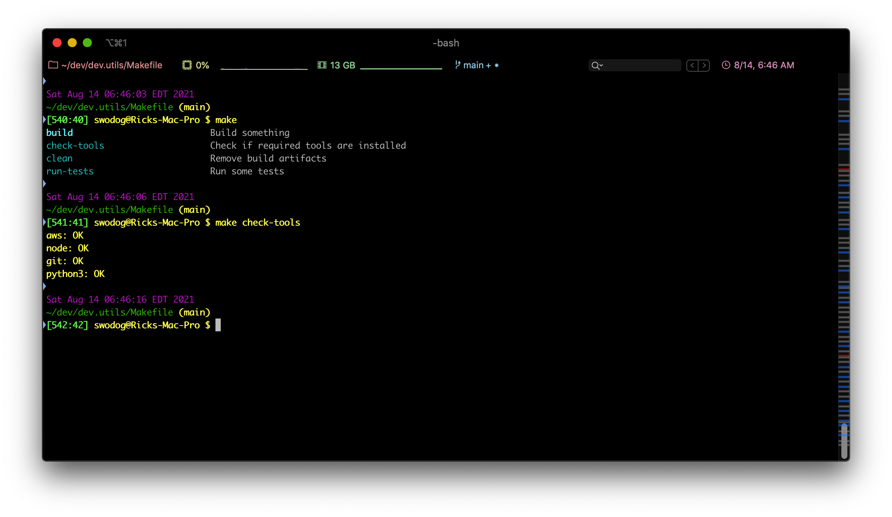

# Makefile
Makefile template that uses Grep, SED, and AWK to generate a help menu.

# Usage

Running `make` with no target specified will display the menu. Running `make check-tools` will call the check-tools target, which iterates over the list over the **TOOLS** list and verifies their available, as figure 1 illustrates.

Figure 1 - Running make and make check-tools

## Add Menu Test

To add menu text append two hash tags to the end of each target line followed by a space and then the menu description text.

**Example:** 

**build:** ## *Build target descriptive text goes here...*

## TOOLS List

The **TOOLS** list is pre-populated with `aws node git python3`  -- Change these as you see fit

